# Kishan Saathi

An AI farming companion for farmers. A farmer can type a question, snap a photo of a sick leaf, speak in the app, or simply phone Saathi, and every one of those paths reaches the same Saathi Agent. The agent remembers the farmer and each of their crops, checks the weather, runs the leaf-disease models when there is a photo, searches the web when it needs fresh information, and answers in the farmer's own language as text and voice. Saathi can also call the farmer back, for example before heavy rain or when a treatment follow-up is due.

This document is the full system design and build plan.

## Contents

1. [Farmer user flow](#1-farmer-user-flow)
2. [System architecture](#2-system-architecture)
3. [Agent and tool orchestration](#3-agent-and-tool-orchestration)
4. [Crop and leaf vision pipeline](#4-crop-and-leaf-vision-pipeline)
5. [Memory architecture (Mem0)](#5-memory-architecture-mem0)
6. [Voice and two-way calling](#6-voice-and-two-way-calling)
7. [Data model and storage](#7-data-model-and-storage)
8. [Deployment and infrastructure](#8-deployment-and-infrastructure)
9. [End-to-end sequence: leaf diagnosis](#9-end-to-end-sequence-leaf-diagnosis)
10. [Tech stack](#10-tech-stack)
11. [Privacy and security](#11-privacy-and-security)
12. [Build plan](#12-build-plan)

---

## 1. Farmer user flow

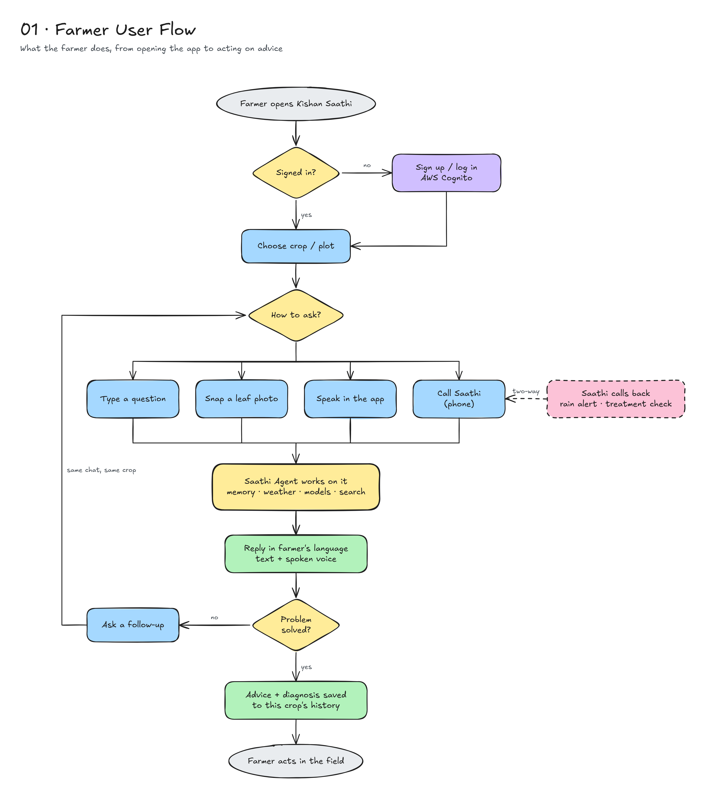

1. The farmer opens Kishan Saathi and signs in through AWS Cognito (first time: sign up).
2. They choose the crop or plot the question is about.
3. They ask in whichever way suits them: type, snap a leaf photo, speak in the app, or call Saathi on the phone.
4. The Saathi Agent works on it using memory, weather, the vision models and web search.
5. The reply comes back in the farmer's language, as text and spoken voice.
6. If the problem is not solved, the farmer asks a follow-up in the same chat, for the same crop.
7. The advice and any diagnosis are saved to that crop's history, and the farmer acts in the field.

Saathi can also start the conversation: an outbound call for a rain alert or a treatment check-in.

---

## 2. System architecture

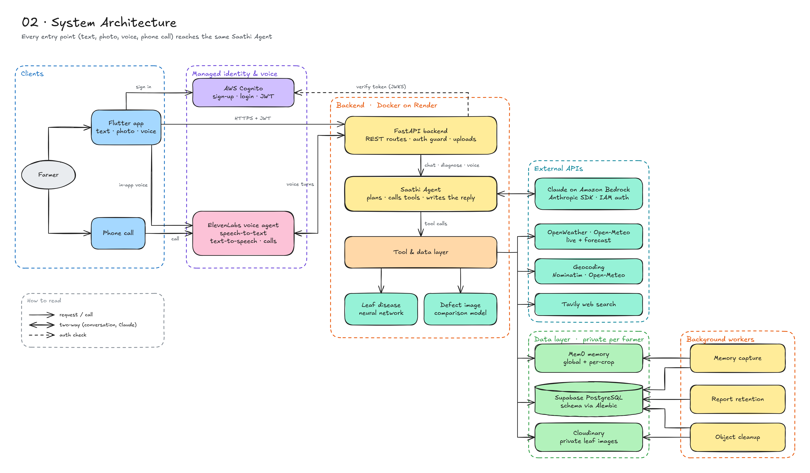

- **Clients.** The Flutter app (text, photo, voice) and a normal phone call.
- **Managed identity and voice.** AWS Cognito issues JWTs; ElevenLabs runs the voice agent (speech-to-text, text-to-speech, calls).
- **Backend (Docker on Render).** FastAPI checks each token against Cognito's JWKS, then hands chat, diagnosis and voice turns to the Saathi Agent. The agent works through a tool and data layer that wraps both neural networks.
- **External APIs.** Claude on Amazon Bedrock, called through the Anthropic SDK and authenticated with AWS IAM, for reasoning and language; the OpenWeather API; and Tavily web search.
- **Data layer.** Mem0 memory, Supabase PostgreSQL (schema managed by Alembic), and Cloudinary for private leaf images. All data is scoped per farmer.

---

## 3. Agent and tool orchestration

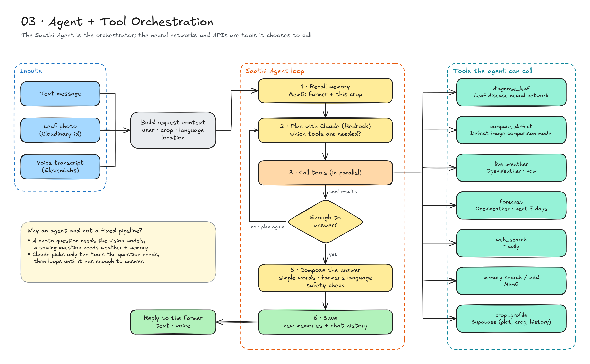

The Saathi Agent is the orchestrator. The neural networks and APIs are tools it chooses to call; there is no fixed pipeline.

**Inputs.** A text message, a leaf photo (as a Cloudinary id), or a voice transcript from ElevenLabs. Each is wrapped into a request context: farmer, crop, language, location.

**The loop.**
1. Recall memory from Mem0 (farmer + this crop).
2. Plan with Claude on Bedrock: which tools does this question need?
3. Call those tools, in parallel where possible.
4. Read the results. If there is not enough to answer, plan again.
5. Compose the answer in simple words, in the farmer's language, with a safety check.
6. Save new memories and the chat history.

**Tools.**

| Tool | Backed by |
|---|---|
| `diagnose_leaf` | Leaf disease neural network |
| `compare_defect` | Defect image comparison model |
| `live_weather` | OpenWeather API (now) |
| `forecast` | OpenWeather API (next 7 days) |
| `web_search` | Tavily |
| `memory` search / add | Mem0 |
| `crop_profile` | Supabase (plot, crop, history) |

A photo question needs the vision models; a sowing question needs weather and memory. Claude picks only what the question needs, using tool calling through the Anthropic SDK.

---

## 4. Crop and leaf vision pipeline

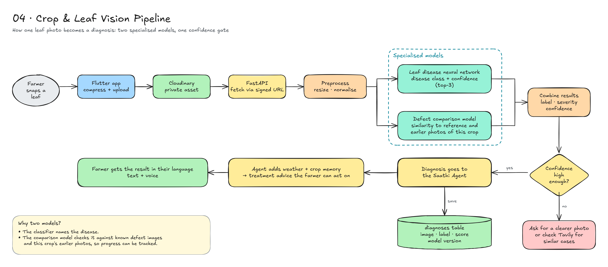

1. The farmer snaps a leaf; the app compresses it and uploads it to Cloudinary as a private asset.
2. FastAPI fetches the image through a signed URL and preprocesses it (resize, normalise).
3. Two specialised models run:
   - **Leaf disease neural network:** disease class + confidence (top-3).
   - **Defect comparison model:** similarity to reference defect images and to earlier photos of the same crop, so progress can be tracked.
4. The results are combined into a label, severity and confidence.
5. **Confidence gate.** If confidence is high enough, the diagnosis goes to the Saathi Agent, which adds weather and crop memory to produce treatment advice. If not, Saathi asks for a clearer photo or checks Tavily for similar cases.
6. Every diagnosis is stored in the `diagnoses` table with the image, label, score and model version.

---

## 5. Memory architecture (Mem0)

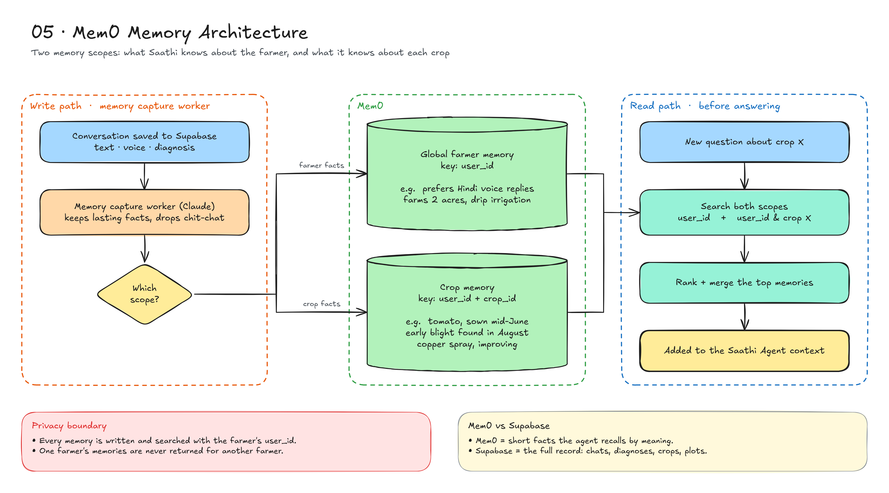

There are two memory scopes:

| Scope | Key | Examples |
|---|---|---|
| Global farmer memory | `user_id` | Prefers Hindi voice replies; farms 2 acres with drip irrigation |
| Crop memory | `user_id` + `crop_id` | Tomato sown mid-June; early blight found in August; copper spray, improving |

- **Write path (after each turn).** A Claude-based extractor keeps lasting facts, drops chit-chat, and routes each fact to the right scope.
- **Read path (before answering).** Both scopes are searched, the top memories are ranked and merged, and they are added to the agent's context.
- **Mem0 vs Supabase.** Mem0 holds short facts the agent recalls by meaning. Supabase holds the full record: chats, diagnoses, crops, plots.

---

## 6. Voice and two-way calling

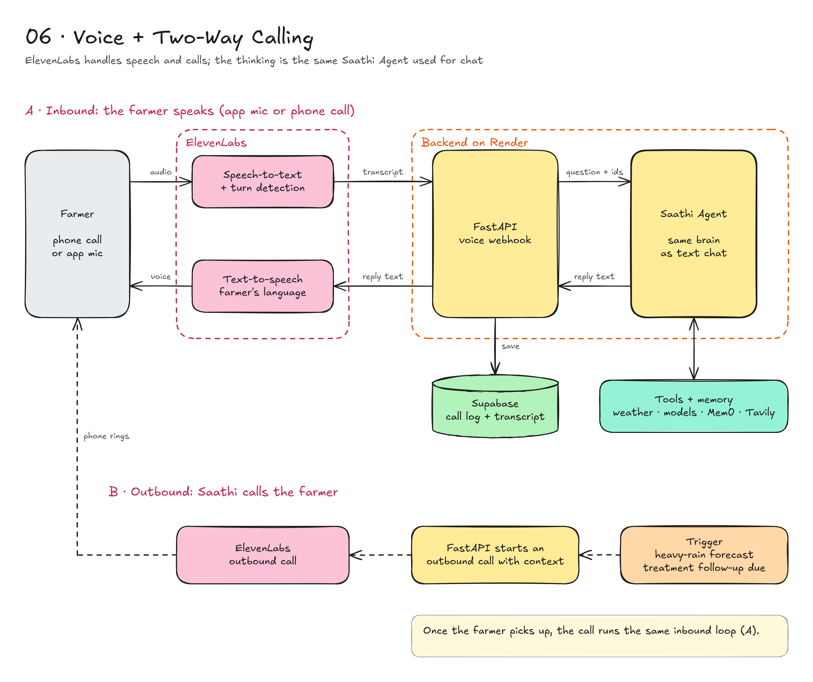

ElevenLabs handles speech and calls. The thinking is done by the same Saathi Agent used for text chat.

**A. Inbound (the farmer speaks, in the app or on a phone call).**
1. ElevenLabs converts the farmer's audio to text and detects the end of each turn.
2. The transcript goes to the FastAPI voice webhook, which passes the question plus farmer and crop ids to the Saathi Agent.
3. The agent uses its tools and memory, then returns reply text.
4. ElevenLabs speaks the reply in the farmer's language.
5. The call log and transcript are saved to Supabase.

**B. Outbound (Saathi calls the farmer).**
1. A trigger fires, for example a heavy-rain forecast or a treatment follow-up that is due.
2. FastAPI starts an outbound call through ElevenLabs, with context.
3. The farmer's phone rings. Once they pick up, the call runs the same inbound loop.

---

## 7. Data model and storage

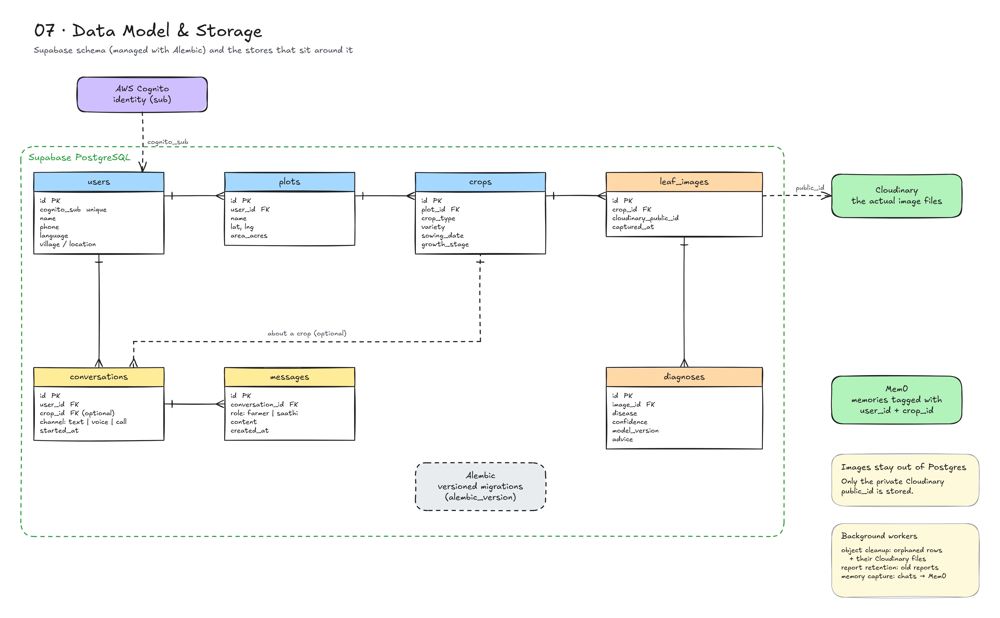

Supabase schema, managed with Alembic migrations:

| Table | Key columns |
|---|---|
| `users` | `id`, `cognito_sub` (unique), `name`, `phone`, `language`, `village / location` |
| `plots` | `id`, `user_id`, `name`, `lat, lng`, `area_acres` |
| `crops` | `id`, `plot_id`, `crop_type`, `variety`, `sowing_date`, `growth_stage` |
| `leaf_images` | `id`, `crop_id`, `cloudinary_public_id`, `captured_at` |
| `diagnoses` | `id`, `image_id`, `disease`, `confidence`, `model_version`, `advice` |
| `conversations` | `id`, `user_id`, `crop_id` (optional), `channel` (text / voice / call), `started_at` |
| `messages` | `id`, `conversation_id`, `role` (farmer / saathi), `content`, `created_at` |

Relationships: a user has many plots, a plot has many crops, a crop has many leaf images, and an image has many diagnoses. A user has many conversations; a conversation can be about one crop and has many messages.

Around the database:
- **AWS Cognito** owns identity; `users.cognito_sub` links to it.
- **Cloudinary** stores the actual image files. Postgres keeps only the private `public_id`.
- **Mem0** stores memories tagged with `user_id` and `crop_id`.

---

## 8. Deployment and infrastructure

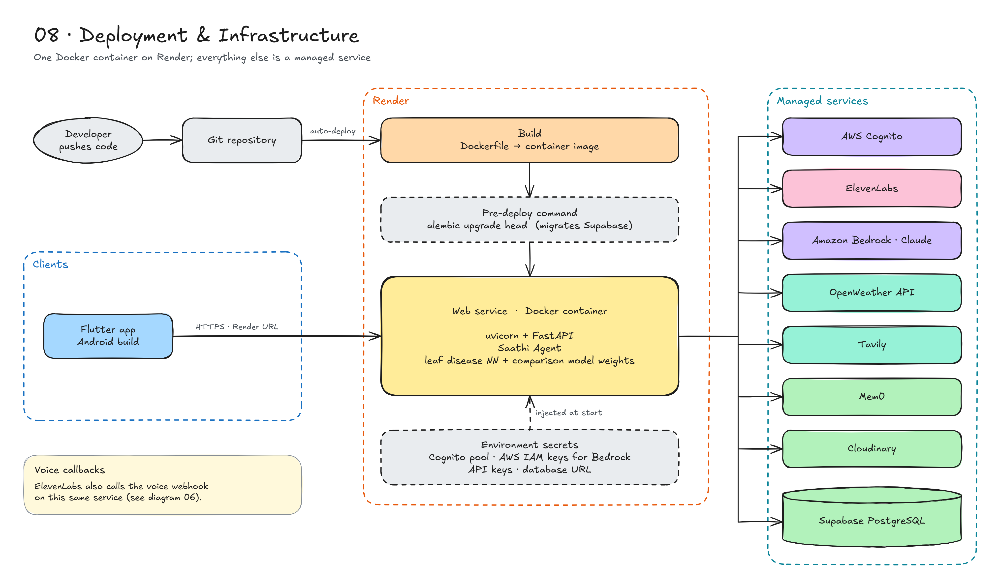

- A push to the Git repository auto-deploys on Render.
- Render builds the Dockerfile into a container image.
- The pre-deploy command runs `alembic upgrade head` to migrate Supabase.
- The web service runs one container: uvicorn + FastAPI, the Saathi Agent, and the weights for the leaf disease model and the comparison model.
- Secrets are injected as environment variables at start: the Cognito pool, the AWS IAM credentials used for Bedrock, the other API keys, and the database URL.
- The Flutter app talks to the service over HTTPS at the Render URL. ElevenLabs calls back into the voice webhook on the same service.
- Everything else is a managed service: AWS Cognito, ElevenLabs, Amazon Bedrock (Claude), OpenWeather, Tavily, Mem0, Cloudinary, Supabase PostgreSQL.

---

## 9. End-to-end sequence: leaf diagnosis

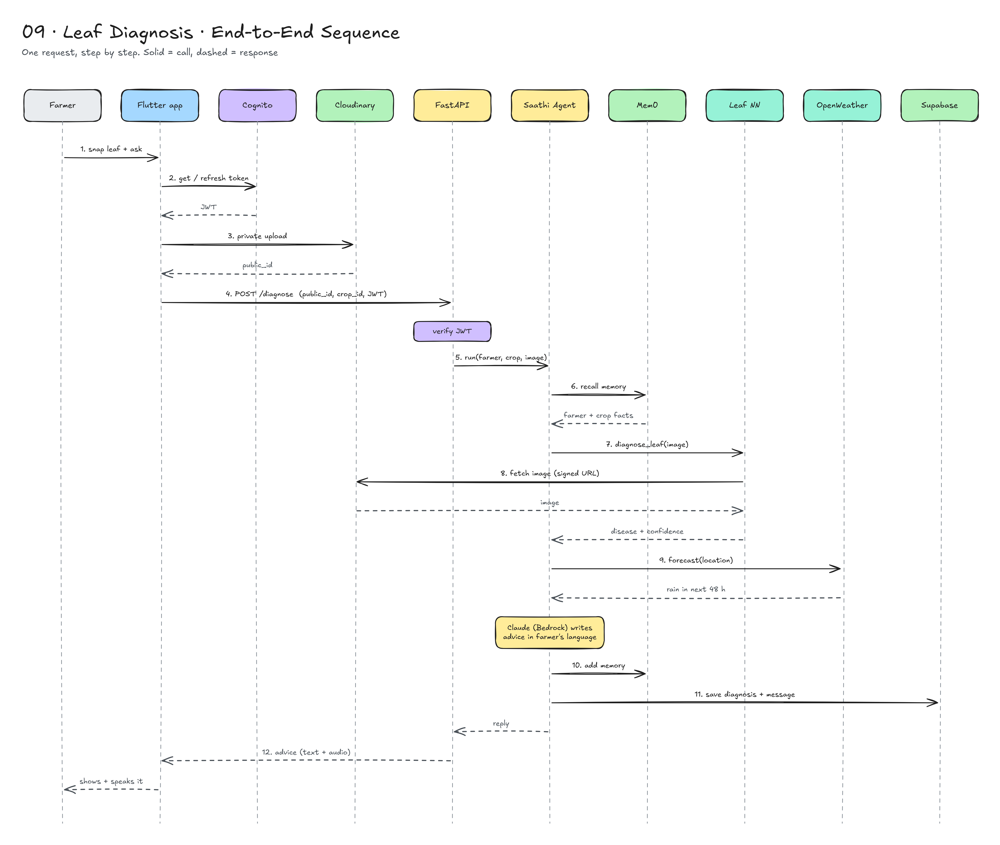

1. The farmer snaps a leaf and asks a question.
2. The app gets or refreshes its JWT from Cognito.
3. The app uploads the photo privately to Cloudinary and receives a `public_id`.
4. The app calls `POST /diagnose` with the `public_id`, `crop_id` and JWT. FastAPI verifies the token.
5. FastAPI runs the Saathi Agent for this farmer, crop and image.
6. The agent recalls farmer and crop facts from Mem0.
7. The agent calls `diagnose_leaf`.
8. The leaf model fetches the image from Cloudinary through a signed URL and returns a disease and confidence.
9. The agent asks OpenWeather for the forecast (for example, rain in the next 48 hours).
10. Claude on Bedrock writes the advice in the farmer's language, and the agent adds a new memory.
11. The agent saves the diagnosis and message to Supabase.
12. FastAPI returns the advice (text + audio), and the app shows it and speaks it.

---

## 10. Tech stack

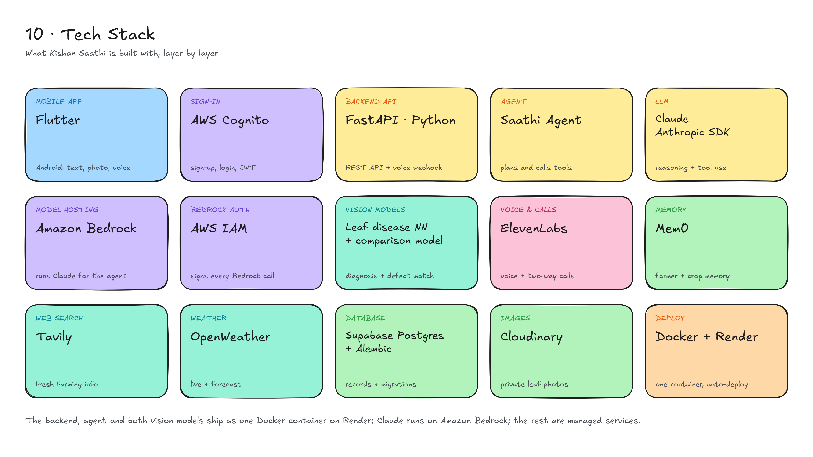

| Layer | Technology | Role |
|---|---|---|
| Mobile app | Flutter | Android app for text, photo and voice |
| Sign-in | AWS Cognito | Sign-up, login, JWT tokens |
| Backend API | FastAPI (Python) | REST routes, auth guard, uploads, voice webhook |
| Agent | Saathi Agent | Plans, calls tools, writes the reply |
| LLM | Claude via the Anthropic SDK | Reasoning, tool use, replies in the farmer's language |
| Model hosting | Amazon Bedrock | Runs Claude for the agent |
| Bedrock auth | AWS IAM | Signs every Bedrock request; credentials stay on the server |
| Vision models | Leaf disease neural network, defect image comparison model | Disease diagnosis and defect matching |
| Voice and calls | ElevenLabs | Speech-to-text, text-to-speech, inbound and outbound calls |
| Memory | Mem0 | Global farmer memory and per-crop memory |
| Web search | Tavily | Fresh farming information |
| Weather | OpenWeather API | Live conditions and forecast |
| Database | Supabase PostgreSQL + Alembic | Records and schema migrations |
| Images | Cloudinary | Private leaf photos |
| Deploy | Docker + Render | One container, auto-deploy |

---

## 11. Privacy and security

- **Authentication.** Every API call carries a Cognito JWT, which FastAPI verifies against Cognito's JWKS before doing any work.
- **Bedrock access.** Calls to Claude on Amazon Bedrock are signed with AWS IAM credentials that live only in the backend's environment, never in the mobile app.
- **Per-farmer isolation.** Every database row, memory and image is scoped by `user_id`. One farmer's data or memories are never returned for another farmer.
- **Private images.** Leaf photos are private Cloudinary assets, read only through short-lived signed URLs. Postgres stores ids, not images.
- **Secrets.** API keys, IAM credentials and database credentials live in Render environment variables, never in the app or the repository.
- **Safe advice.** The agent's compose step includes a safety check, and low-confidence diagnoses ask for a better photo instead of guessing.

---

## 12. Build plan

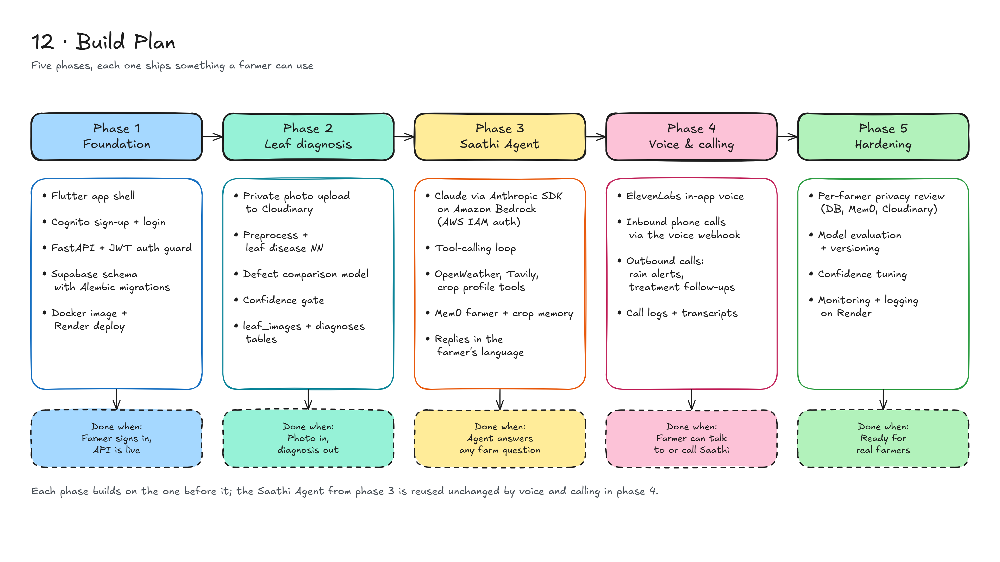

**Phase 1: Foundation**
- Flutter app shell with Cognito sign-up and login.
- FastAPI service with the JWT auth guard.
- Supabase schema with Alembic migrations (users, plots, crops).
- Docker image and Render deploy with the pre-deploy migration.

**Phase 2: Leaf diagnosis**
- Private photo upload to Cloudinary from the app.
- Preprocessing plus the leaf disease neural network.
- Defect image comparison model against reference and earlier photos.
- Confidence gate and the `leaf_images` / `diagnoses` tables.

**Phase 3: Saathi Agent**
- Agent loop on Claude through the Anthropic SDK, hosted on Amazon Bedrock with AWS IAM auth.
- Tools: OpenWeather (live + forecast), Tavily search, crop profile.
- Mem0 global and per-crop memory, with read and write paths.
- Conversations and messages, with replies in the farmer's language.

**Phase 4: Voice and calling**
- ElevenLabs voice agent for in-app voice.
- Inbound phone calls through the FastAPI voice webhook.
- Outbound calls for rain alerts and treatment follow-ups.
- Call logs and transcripts in Supabase.

**Phase 5: Hardening**
- Privacy review of per-farmer scoping across database, Mem0 and Cloudinary.
- Model evaluation, versioning and confidence tuning.
- Monitoring and logging on Render.
